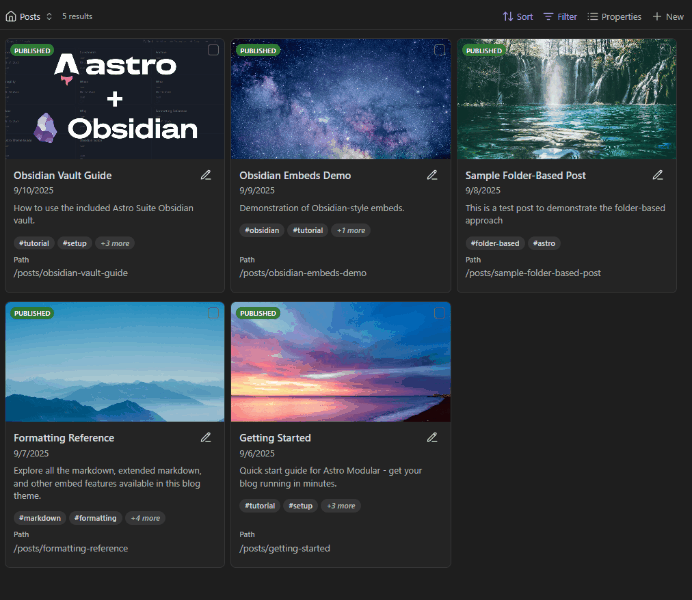

[Bases CMS](https://github.com/davidvkimball/obsidian-bases-cms) lets you treat a grid of content like a content management system. Requires the [Bases](https://help.obsidian.md/bases) core plugin to be enabled.

### Features

- **Card-based CMS view** — display your base entries as cards with thumbnails, snippets, and property information in a grid layout.
- **Bulk editing** — select multiple items and edit properties at once. Use `Shift + Click` anywhere on a card to toggle selection.
- **Draft toggling** — toggle publish/draft status for multiple files at once with visual indicators on cards.
- **Tag management** — add or remove tags from multiple files simultaneously.
- **Property management** — set or remove properties across multiple files with bulk operations.
- **Inline renaming** — rename content right from the grid view.
- **Smart deletion** — automatically delete parent folders when deleting files with specific names (like `index.md`), and optionally remove unique attachments only used by deleted notes.
- **Quick Edit** — execute Obsidian commands directly from card titles without opening files first. Configure a command and icon to appear on each card.
- **Custom views** — configure the CMS view and add new views to your liking.
- **Static GIF option** — force static images for animated GIFs in card thumbnails.

### Bulk Operations Toolbar

| Button | Description |
| --- | --- |
| Select all | Select all visible cards |
| Clear | Deselect all cards |
| Publish | Remove draft status from selected items |
| Draft | Add draft status to selected items |
| Tags | Open a modal to add or remove tags |
| Set | Set a property value across selected items |
| Remove | Remove a property from selected items |
| Delete | Delete selected items (with optional confirmation) |

Each toolbar button can be individually shown or hidden in settings.

Bases CMS works together with [Home Base](/plugins/home-base/) to provide a directory of all your content.

### Commands

- **Select all visible cards**: Select all cards in the current view.
- **Deselect all cards**: Clear the current selection.

### Settings

- **Confirm bulk operations** — toggle confirmation dialogs for bulk operations.
- **Toolbar buttons** — show or hide individual toolbar buttons.
- **Delete parent folder for specific file name** — enable smart folder deletion (e.g., delete parent folder when deleting `index.md`).
- **Folder deletion file name** — specify the file name that triggers parent folder deletion (default: `index`).
- **Delete associated unique attachments** — automatically delete attachments only used by deleted notes.
- **Confirm deletions** — toggle confirmation dialogs before deleting files.
- **Use home icon for CMS view** — switch between home and blocks icon in the Bases view selector.
- **Enable quick edit** — show quick edit icon on card titles with a configurable command and icon.
- **Embedded view refresh debounce** — delay in milliseconds before refreshing embedded views.
- **Virtual scroll threshold** — number of items before enabling virtual scrolling.
- **Virtual scroll buffer** — number of extra items to render above and below the visible area.
