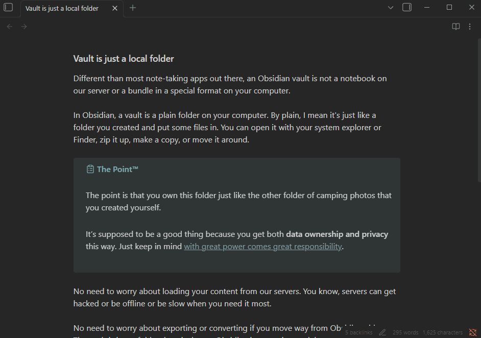

[Disable Tabs](https://github.com/davidvkimball/obsidian-disable-tabs) is off by default, but if enabled, opening or closing tabs will always replace the current tab with the new one, even replacing pinned tabs.

This is especially useful when you're hiding the tab bar and don't want multiple tabs cluttering your workspace. If you enable this, you might consider adjusting [UI Tweaker](/plugins/ui-tweaker/) settings under the Hider > Navigation section.

### Settings

| Setting | Default |
| --- | --- |
| Hide mobile tabs icon | Off |
