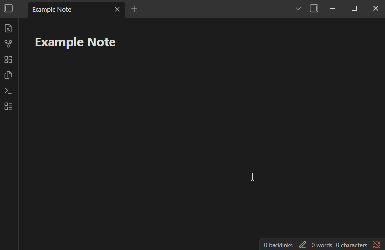

[Link As](https://github.com/davidvkimball/obsidian-link-as) turns selected (or typed) text into a link to any note while keeping that text as the inline display, without writing anything to the target note. It pairs well with [Property Over File Name](/plugins/property-over-file-name/): the note picker can list notes by their title property instead of the file name, so you find them by their real title.

In Vault CMS, the links it creates convert cleanly through [Astro Composer](/plugins/astro-composer/), which preserves your display text when it rewrites Obsidian links for the published site.

### Usage

Run the command **Link As: link text to a note** (suggested hotkey: `Ctrl/Cmd+Shift+K`).

- **With text selected**: your selection becomes the display text. Pick a note and the selection turns into a link using that text.
- **With nothing selected**: type the display text (or leave it empty to use the note's title), then pick a note.

The link is inserted in your configured format (wikilink or Markdown), and a redundant alias is omitted when the display text just repeats the file name. Nothing is written to the target note's properties.

### Settings

- **Show file path in picker**: show each note's path as a muted second line under its title in the note picker.
