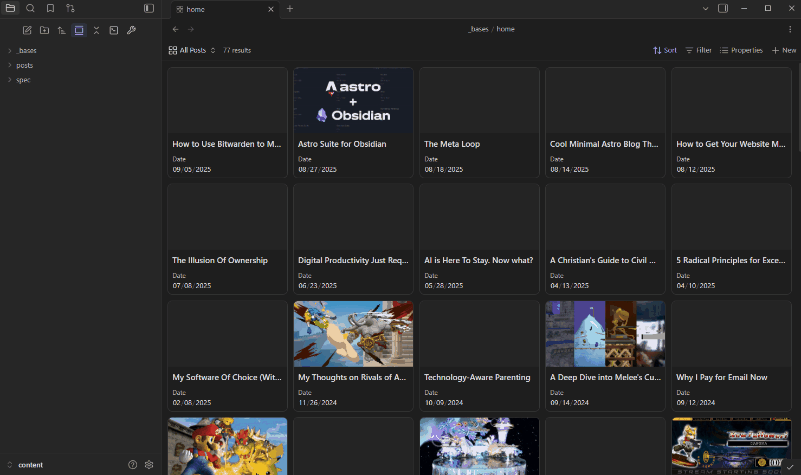

The [SEO](https://github.com/davidvkimball/obsidian-seo) plugin provides a comprehensive audit of your content for search engine rankings and AI parsing.

### Features

#### Content Quality Checks

- **Content length** — minimum word count threshold.
- **Reading level** — analyzes readability and complexity.
- **Keyword density** — optimal keyword usage (configurable min/max thresholds).
- **Duplicate content** — detects similar content across notes (configurable similarity threshold).
- **Duplicate titles** — identifies duplicate titles across your vault.
- **Duplicate descriptions** — finds duplicate meta descriptions.

#### Technical SEO Checks

- **Title optimization** — proper title length and structure.
- **Meta description** — properties description validation.
- **Keyword in title, description, and slug** — ensures keywords appear where they should.
- **Heading structure** — proper H1–H6 hierarchy (with option to skip H1 check).
- **Media alt text** — missing alt text detection for images, videos, and embeds.
- **Image naming** — SEO-friendly image filename patterns.

#### Link Management

- **Broken links** — detects non-existent internal links.
- **Potentially broken links** — identifies links that may be broken.
- **External links** — validates external link accessibility (optional, requires internet).
- **Naked links** — identifies unformatted URLs.
- **Broken embeds** — detects potentially broken embedded content.

### Commands

| Command | Description |
| --- | --- |
| Open current note audit | Open the current note audit panel |
| Open vault audit | Open the vault-wide audit panel |
| Run current note audit | Open panel and run audit on current note. Activate with `CTRL + SHIFT + A`. |
| Run vault audit | Open panel and run audit on all notes |

### SEO Score System

The plugin uses a weighted scoring system:

- **Critical issues** (10x weight): Broken links, missing titles.
- **Important issues** (5x weight): Missing alt text, meta descriptions.
- **Moderate issues** (3x weight): Content length, readability.
- **Minor issues** (1x weight): Warnings and notices.

**Score range**: 40–100 (40 = needs work, 100 = excellent).

### Settings

- **Scan directories** — configure which directories to include in vault-wide audits.
- **Individual checks** — turn off any check you don't care about or tweak scoring logic.
- **External link checking** — disabled by default; enable in settings if desired. All other checks work entirely offline.
- **Ignore underscore files** — skip files with underscore prefix (drafts).
- **MDX support** — enable to include `.mdx` files in audits.
- **Use filename as title/slug** — fallback to filename when properties are missing.
- **Parent folder slug filename** — use parent folder name for slug detection.
- **Title prefix/suffix** — configure title patterns for SEO checks.
- **Use note titles** — use property titles instead of filenames in reports.
- **Skip H1 check** — disable the heading structure H1 requirement.
- **Publish mode** — only audit published (non-draft) content.
- **Show ribbon icon** — toggle the SEO ribbon icon.
- **Default sort** — configure default sort order for audit results.
- **Caching** — first scan builds cache (slower), subsequent scans use cache (faster).
