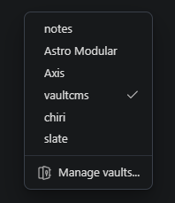

[Vault Nickname](https://community.obsidian.md/plugins/vault-nickname) lets you assign a friendly display name to your Obsidian vault. The nickname appears in the vault switcher, the window title, and the Obsidian dock, independent of the folder name on disk.

This is particularly useful when running multiple Vault CMS installs across separate Astro projects. Folder names like `src/content` are not very identifying when three of them are open in your switcher. A nickname makes the right vault obvious at a glance.

### Features

- **Custom vault name**: shown anywhere Obsidian would normally display the folder name.
- **Per-vault**: each vault remembers its own nickname.
- **No filesystem changes**: the on-disk folder name stays untouched, so your Astro project structure is unaffected.

### Setting a nickname

Open the plugin settings (Settings → Vault Nickname) and type the display name you want. The change applies immediately to the switcher and window title.
